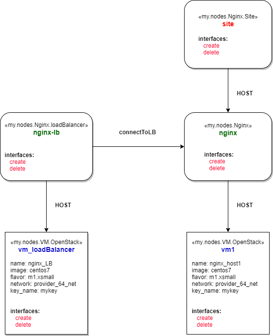

# webApp-loadbalancer-DB-TOSCA
Deploy two WebApps, one loadbalancer, and one database instance at one go using TOSCA and xOpera.

General architecture:

Service template illustration:

_Note: This is developed and implemented in , University of Tartu._
